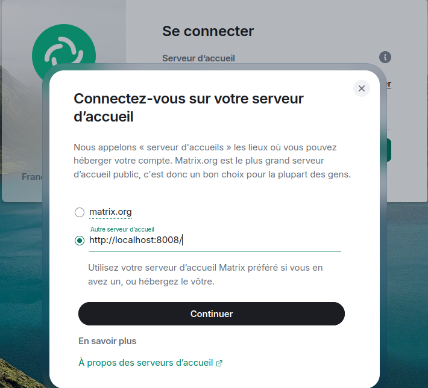
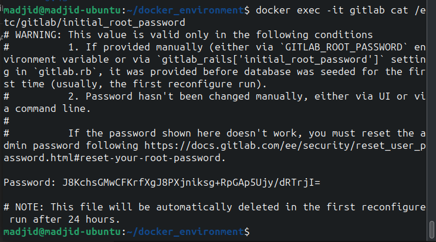
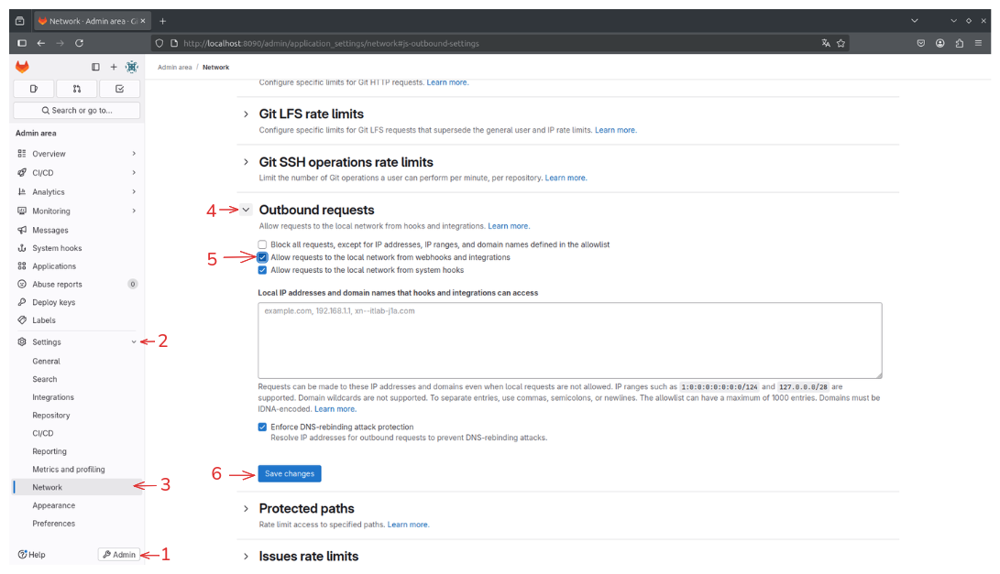
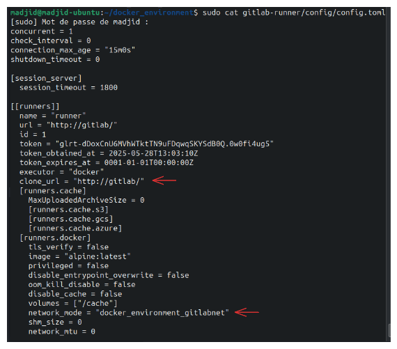

# Instructions de configuration de la stack

---

## Structure du projet

```
docker-environment/
├── docker-compose.yml
├── synapse/
│   └── data/...
├── gitlab-runner/
│   └── config/...
├── gitlab/
│   ├── config/...
│   ├── logs/...
│   └── data/...
└── hookshot/
    └── config/
        ├── config.yml
        ├── passkey.pem
        └── registration.yml
```

---

## Initialisation de la config Synapse

Tout d'abord on doit préparer la config de Synapse (C'est à faire une seul fois):

```bash
docker run -it --rm \
  -v $(pwd)/synapse/data:/data \
  -e SYNAPSE_SERVER_NAME=localhost \
  -e SYNAPSE_REPORT_STATS=no \
  matrixdotorg/synapse:latest \
  generate
```

Puis on ajoute ces lignes à la fin du fichier généré **synapse/data/homeserver.yaml** :

```
enable_registration: true
enable_registration_without_verification: true

public_baseurl: "http://localhost:8008"

app_service_config_files:
  - /data/hookshot-registration.yml
```

---

## Génération de la passkey pour hookshot

```bash
openssl genpkey -out hookshot/config/passkey.pem -outform PEM -algorithm RSA -pkeyopt rsa_keygen_bits:2048
```

---

## Lancement de la stack

Dans le dossier `docker-environment`, on exécute :

```bash
docker compose up -d
```

Cela va démarrer :

* Synapse (serveur Matrix)
* Element (client web Matrix avec une interface locale sur le port 8080)
* GitLab CE (avec une interface locale sur le port 8090)
* GitLab-Runner
* Hookshot (bridge d'intégration GitLab/Matrix)

---

## Créer un compte admin Matrix (Synapse)

```bash
docker exec synapse \
  register_new_matrix_user \
  -u admin -p adminpass \
  -a -c /data/homeserver.yaml http://localhost:8008
```

Puis on se connecte **[http://localhost:8080](http://localhost:8080)** (Element). On modifie le serveur matrix: **http://localhost:8008/** (Synapse)



Le user: `admin` et le mot de passe: `adminpass`

---

## Débloquer les inscriptions sur GitLab

On récupère d'abord le mot de passe root de gitlab avec la commande : 

```bash
docker exec -it gitlab cat /etc/gitlab/initial_root_password
```


Puis, on se onnecte à GitLab (**[http://localhost:8090](http://localhost:8090)**) avec le user: `root` et le mote de passe qu'on a récupéré.

NB: Il faut modifier le mot de passe initial dès la première connexion.

---

## Débloquer les rêquetes réseaux internes sur GitLab

Sur Admin Area > Settings > Network > Outbound requests, on active cette option: "Allow requests to the local network from webhooks and integrations". Puis, on sauvgarde.



---

## Authentifier Hookshot à GitLab

Dans la discussion privé avec le bot `@hookshot:localhost`, on tape la commande :

```
gitlab personaltoken gitlab glpat-xxxxx
```

> On remplace `glpat-xxxxx` par le token GitLab (créé dans `User Settings > Access Tokens`)

---

## Connecter un projet GitLab au salon Matrix

Dans un salon non chiffré, on doit ajouter @hookshot:localhost comme membre, et lui donner le rôle moderateur ou admin, on tape la commande :

```
!hookshot gitlab project http://gitlab/chemin_vers_le_projet
```

On verra : `Room configured to bridge chemin_vers_le_projet`

NB: Notez bien que l'url du projet, on remplace localhost:8090 avec gitlab car le gitlab est le nom de l'instance vu par hookshot.

---

## Ajouter un webhook dans GitLab si ce n'est pas déjà fait automatiquement :

Dans le projet GitLab → `Settings > Webhooks`

* **URL** :

```
http://hookshot:9000/
```

* **Secret Token** :

```
my-secret
```

* On coche tous les événements qu'on veut recevoir (push, merge, etc.)
* On clique sur **Add webhook**

---

## Commandes utiles

```bash
docker compose up -d             # Lancer la stack
docker compose logs -f hookshot  # Voir les logs Hookshot
docker exec -it synapse bash     # Accéder au conteneur Synapse
docekr compose down              # Arreter la stack
```
## Gitlab Runner : 

On a ajouter un GitLab Runner, pour faire :  

- On crée un token dans GitLab > Admin Area > Runners > New instance runner

- On exécute : 

```bash
docker exec -it gitlab-runner gitlab-runner register
```

- On répond aux questions comme suit :

GitLab instance URL : http://gitlab/

Token : <on colle ici le token donné par GitLab>

Runner name : par exemple: Runner

Executor : docker

Image Docker : alpine:latest

- Puis dans le fichier gitlab-runner/config/config.toml, on ajoute ces 2 lignes comme montrer dans l'image :

```
clone_url = "http://gitlab"

network_mode = "docker_environment_gitlabnet"
```


